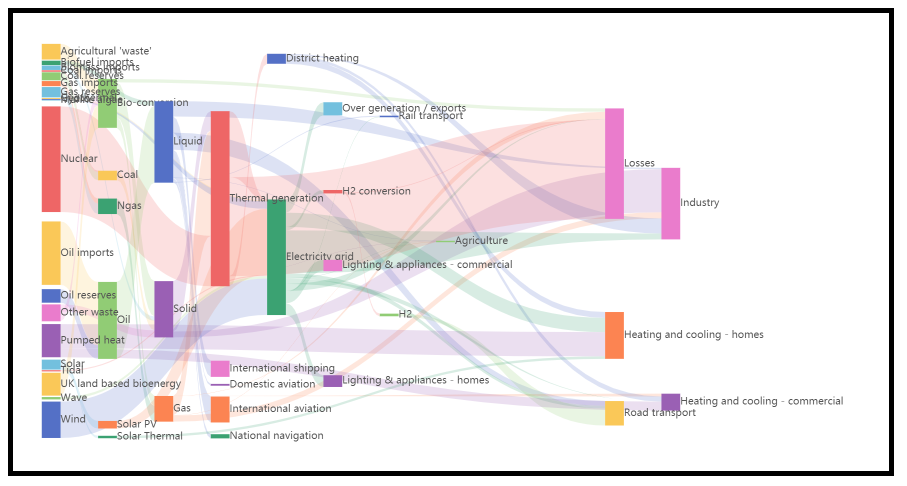

# sankey
饼图组件，包括选中效果、文字说明等常见的饼图。

<p align='center'></p>

<p>
  <a href="https://hai2007.gitee.io/npm-downloads?interval=7&packages=@clunch/sankey"></a>
  <a href="https://www.npmjs.com/package/@clunch/sankey"></a>
  <a href="https://github.com/clunch-contrib/sankey/graphs/commit-activity" target='_blank'></a>
  <a href="https://github.com/clunch-contrib/sankey/blob/master/LICENSE"></a>
  <a href="https://github.com/clunch-contrib/sankey" target='_blank'></a>
</p>

## 如何使用？

首先，需要安装npm包（目前我们仅支持npm方式管理）：

```
npm install --save clunch @clunch/sankey
```

然后注册组件：

```js
import Clunch from 'clunch';
import sankey from '@clunch/sankey';

Clunch.series('ui-sankey',sankey);
```

然后，你就可以使用这个组件了：

```html
<ui-sankey data='Array' />
```

- data:数据，应该是一个数组（比如：```  ```）

除了上面的必输项外，还有下列可选项：

|属性|类型|描述|默认值|可选值|
|----|----|----|----|----|

由于此组件是基于[Clunch](https://github.com/hai2007/clunch)开发的，我们默认你已经掌握了相关知识。

[<< 你可以点击此处学习Clunch.js如何使用](https://hai2007.gitee.io/clunch/#/course/introduce?fixed=top)


开源协议
---------------------------------------
[MIT](https://github.com/clunch-contrib/sankey/blob/master/LICENSE)

Copyright (c) 2021 [hai2007](https://hai2007.gitee.io/sweethome/) 走一步，再走一步。
